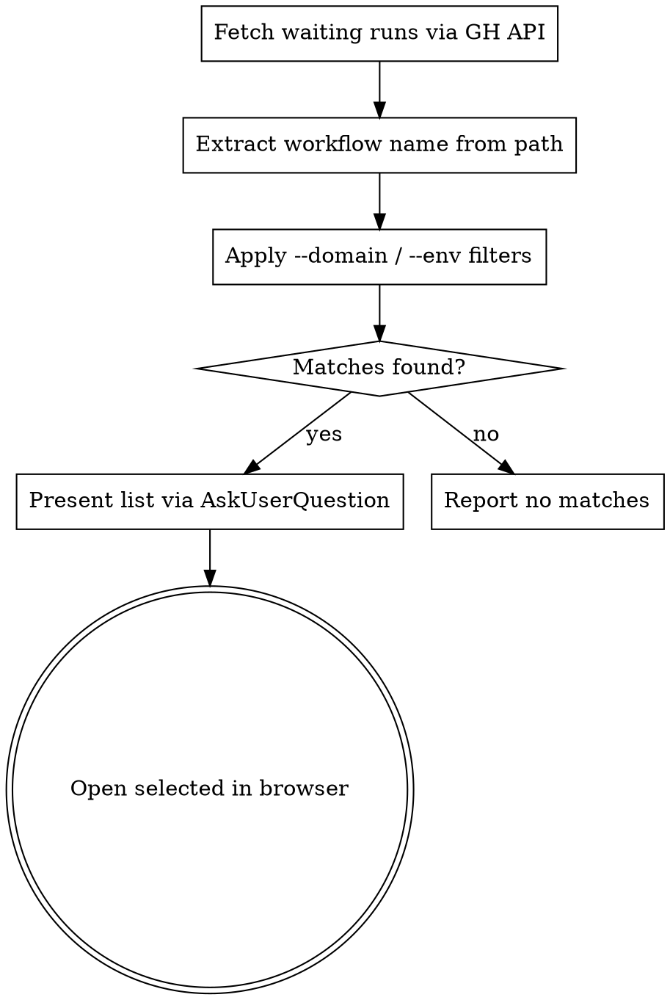

# Deploy Workflow

Find your pending Terraform deployment workflows in `fanatics-gaming/fanapp-terraform` and open them in GitHub Actions.

## Arguments

- **No arguments:** Your waiting workflows on `main` created in the last 1 hour
- **Time window:** `30m`, `1h` (default), `2h`, `1d` — lookback duration. Format: `<N><unit>` where unit is `m` (minutes), `h` (hours), `d` (days). Convert to ISO 8601 timestamp for the `created` API filter.
- **`--domain <name>`:** Filter by domain (e.g., `fes-loyalty`, `fanapp`, `fes-streaming`)
- **`--env <name>`:** Filter by environment (e.g., `dev`, `prod`, `test`)
- **`--all`:** Show all users' waiting runs, not just yours
- **`--branch <name>`:** Override branch filter (default: `main`)

## Workflow



### Step 1: Fetch Waiting Runs

Calculate the `created` cutoff timestamp: default is 1 hour ago, or parse the time window argument. Use `date -u -v-<N><unit> +%Y-%m-%dT%H:%M:%SZ` to compute the ISO 8601 timestamp (e.g., `date -u -v-1H` for 1 hour, `date -u -v-2H` for 2 hours, `date -u -v-30M` for 30 minutes, `date -u -v-1d` for 1 day).

Use the GitHub API directly (not `gh run list`) to support actor and time filtering:

```bash
SINCE=$(date -u -v-1H +%Y-%m-%dT%H:%M:%SZ)
gh api "repos/fanatics-gaming/fanapp-terraform/actions/runs?status=waiting&branch=main&actor=ian-at-fes&per_page=50&created=>=$SINCE" --jq '[.workflow_runs[] | {id: .id, path: .path, created: .created_at}]'
```

- If time window arg provided (e.g., `2h`, `30m`, `1d`): adjust the `-v` flag accordingly
- If `--all` provided: remove `&actor=ian-at-fes` from the query
- If `--branch` provided: replace `main` with that value

### Step 2: Extract Workflow Name

The `path` field contains the workflow file: `.github/workflows/<name>.yaml`

Strip the prefix and `.yaml` suffix to get a human-readable name. Examples:

| path | display name |
|---|---|
| `.github/workflows/fes-streaming-dev.yaml` | `fes-streaming-dev` |
| `.github/workflows/fes-datadog_prod_org.yaml` | `fes-datadog_prod_org` |
| `.github/workflows/prod_infra.yaml` | `prod_infra` |
| `.github/workflows/fes-loyalty-infra-dev.yaml` | `fes-loyalty-infra-dev` |
| `.github/workflows/inf-dev_infra.yaml` | `inf-dev_infra` |

### Step 3: Apply Filters

If `--domain` provided: keep only runs where the workflow name contains the domain string.
If `--env` provided: keep only runs where the workflow name contains the env string.

Both filters use substring matching for simplicity.

### Step 4: Present Results

Deduplicate: if the same workflow name appears multiple times (multiple batches), show only the most recent run.

Use `AskUserQuestion` to show matching workflows. Each option:

- **Label**: workflow name (e.g., `fes-streaming-dev`)
- **Description**: `Run #<id> | Created: <created>`

If no matches: report clearly, including which filters were applied.
If one match: still present for confirmation.
AskUserQuestion has a max of 4 options. If more than 4 matches, show the 4 most recent and note how many total were found.

### Step 5: Open in Browser

Run: `open https://github.com/fanatics-gaming/fanapp-terraform/actions/runs/<id>`
